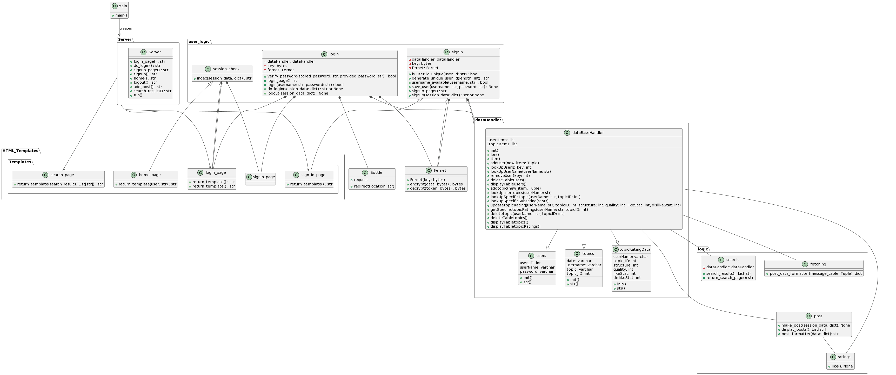

# Term Project - Team J
***
## Project Status 
#### Status after Sprint 2:

##### Updates:

* Changed the format of how posts are saved.
* Changed the status of how posts are displayed.
* Added search functionality.
* Session management completed.
* Login bug from Sprint 1 was fixed.
* Overall improved UI of home page and search page.

##### Backlogs:
* Ratings functionality not completely working. 
* Dark mode feature still not implemented.
* Search for other users still not implemented.
* Saving post drafts still not implemented.
* Blocking feature not implemented.
* Profile picture upload not implemented.
* No different themes added.

## Project details
### Starting the app 

Running the main.py file should get the app started. Fernet needs to be installed.
### The Docs folder
##### Contains: 
- Component Architecture - Contains individual component details
- performance_reviews/ Sprint_2- Contains all the performance reviews done by everyone.
- user_stories/ - Contains all the user stories
- meetingNotes.md - Contains the meeting notes.
- applogic.md - Contains the applogic. Used only as a reference.
- Process Analysis - Goes over how decisions were made.
- UML - Contains the UML Diagrams.
## The Architecture 

- **Server - Gurleen**
- **logic - Rishi**
- **dataHandler - Baasil**
- **HTML_Templates - Cameron**
- **user_logic - Saurav**

## Progress tracking
- Meeting notes can be found [here.](https://github.com/CS2005F23/term-project-teamj/blob/master/docs/meetingNotes.md)
- Kanban board can be found [here.](https://github.com/orgs/CS2005F23/projects/19)

## Individual details
### File locations

There is a directory that contains performance reviews and user stories and features done by each person in the docs folder.
The project files done by each person are stored in individual folders. Details about the task, folders
and individual branches are given in the following table below.

### Task assignment Details

| Task                                           | Folder         | Owner   | Branch Name |
|------------------------------------------------|----------------|---------|-------|
| HTML and templating engine                     | HTML_Templates  | Cameron |    cameron     |
| Logic for the app                              | logic      | Rishi   |     rishi       |
| Server for the app                             | server     | Gurleen |  gurleen |
| Object mapping and persistent storage solution | storage    | Baasil  |  baasil |
| User info and Session management               | user_logic | Saurav  |     saurav      |

## Individual folder details

### HTML_Templates
##### Contains:
- Templates/ - Contains home_page.py, login_page.py and sign_in.py which manipulates html code and returns them as templates

### logic
##### Contains:
- post.py Handles the post fetching, adding and display logic
### server
##### Contains:
- Server.py - Contains the implementation for the server runs server and maintains routes
- serverData
### storage
##### Contains:

- APP.db - Database file.
- dataHandler.py - Contains the dataBaseHandler class responsible for manipulating data.
- dbCreator.py - Created an initial handler and contains some sample users and messages.
- test_dataHandler.py - Test class for testing the functionality. Can be directly run (without "python -m unittest" command.)
- attributions.md - The attributions file.
### user_logic
##### Contains:
- login.py - login logic
- session_check.py - checks if the user is logged in
- signin.py - adds user to the database and verifies their username

## Architecture Details

Architecture details can be found [here.](https://github.com/CS2005F23/term-project-teamj/tree/master/docs/Component%20Architecture)

## Code Reviews
* Code reviews were done on github in the form of Pull request feedbacks.
* Pull request number: (#24, #25, #26, #29, #32, #33, #34, #35, #36, #39, #40, #41)
* [#24](https://github.com/CS2005F23/term-project-teamj/pull/24)
* [#25](https://github.com/CS2005F23/term-project-teamj/pull/25)
*  [#26](https://github.com/CS2005F23/term-project-teamj/pull/26)
*  [#29](https://github.com/CS2005F23/term-project-teamj/pull/29)
*  [#32](https://github.com/CS2005F23/term-project-teamj/pull/32)
*  [#33](https://github.com/CS2005F23/term-project-teamj/pull/33)
*  [#34](https://github.com/CS2005F23/term-project-teamj/pull/34)
*  [#35](https://github.com/CS2005F23/term-project-teamj/pull/35)
*  [#36](https://github.com/CS2005F23/term-project-teamj/pull/36)
* [#39](https://github.com/CS2005F23/term-project-teamj/pull/39)
* [#40](https://github.com/CS2005F23/term-project-teamj/pull/40)
* [#41](https://github.com/CS2005F23/term-project-teamj/pull/41)

