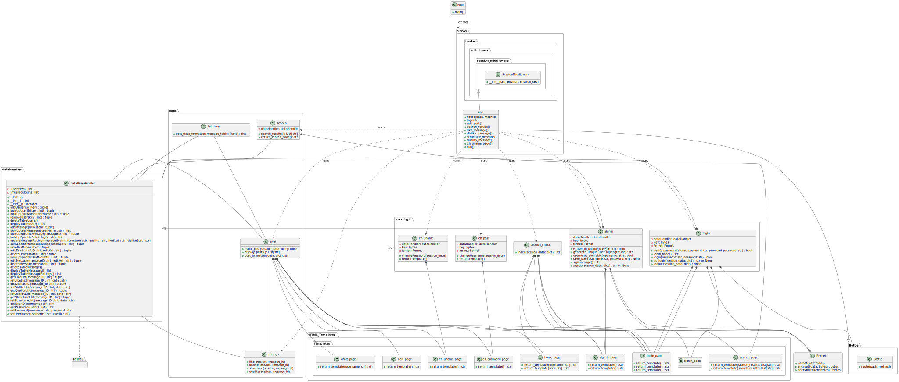

******************************************************************************************************************************************************************************
# Note: 
As part of a collaborative university course project, our team of five developed a basic message board application using Python.  This project involved the entire software development lifecycle, from initial planning and design to implementation and testing. We embraced the Agile methodology, utilizing regular meetings, sprint planning, and thorough documentation to simulate a real-world software engineering environment. My contributions included [specific coding tasks or areas of focus] and actively participating in team discussions and decision-making processes.  This experience allowed me to not only hone my Python programming skills but also to gain valuable insights into collaborative software development and Agile practices.
******************************************************************************************************************************************************************************

# Term Project - Team J
***
## Project Status 
#### Status after Sprint 3:
##### Updates
* Fixed the ratings functionality from sprint 2
* Added functionality to change usernames and passwords
* Added some functionality to save drafts, not fully implemented
* Added some functionality to edit posts, not fully implemented

#### Status after Sprint 2:

##### Updates:
* Please run "pip install cryptography" in the terminal
* Changed the format of how posts are saved.
* Changed the status of how posts are displayed.
* Added search functionality.
* Session management completed.
* Login bug from Sprint 1 was fixed.
* Overall improved UI of home page and search page.

##### Backlogs:
* Ratings functionality not completely working. 
* Dark mode feature still not implemented.
* Search for other users still not implemented.
* Saving post drafts still not implemented.
* Blocking feature not implemented.
* Profile picture upload not implemented.
* No different themes added.

## Project details
### Starting the app 

Running the main.py file should get the app started. Requirements need to be installed.
### Root (\\)
- main.py to start the project
- README.md
- requirement.txt - The requirements file
### The Docs folder
##### Contains: 
- Component Architecture - Contains individual component details
- hypotheticals - Contains individual hypothetical files
- Microservices Architecture - Contains the microservice architecture diagrams.
- performance_reviews/ - Contains all the performance reviews done by everyone.
- user_stories/ - Contains all the user stories
- meetingNotes.md - Contains the meeting notes.
- applogic.md - Contains the applogic. Used only as a reference.
- Process Analysis - Goes over how decisions were made.
- UML - Contains the UML Diagrams.

## The Architecture 

The architecture document is stored in the UML folder. Image may not load due to size. It is linked to 
[here. (Full_Project_Sprint_3.png)](https://github.com/CS2005F23/term-project-teamj/tree/master/docs/UML)

- **Server - Gurleen**
- **logic - Rishi**
- **dataHandler - Baasil**
- **HTML_Templates - Cameron**
- **user_logic - Saurav**

## Progress tracking
- Meeting notes can be found [here.](https://github.com/CS2005F23/term-project-teamj/blob/master/docs/meetingNotes.md)
- Kanban board can be found [here.](https://github.com/orgs/CS2005F23/projects/19)

## Individual details
### File locations

There is a directory that contains performance reviews and user stories and features done by each person in the docs folder.
The project files done by each person are stored in individual folders. Details about the task, folders
and individual branches are given in the following table below.

### Task assignment Details

| Task                                           | Folder         | Owner   | Branch Name |
|------------------------------------------------|----------------|---------|-------|
| HTML and templating engine                     | HTML_Templates  | Cameron |    cameron     |
| Logic for the app                              | logic      | Rishi   |     rishi       |
| Server for the app                             | server     | Gurleen |  gurleen |
| Object mapping and persistent storage solution | storage    | Baasil  |  baasil |
| User info and Session management               | user_logic | Saurav  |     saurav      |

## Individual folder details

### HTML_Templates
##### Contains:
- Templates/ - Contains home_page.py, login_page.py and sign_in.py which manipulates html code and returns them as templates. Also contains
ch_password_page and ch_uname_page.py which contains the change password and change username files. The search_page.py contains the search page.

### logic
##### Contains:
- post.py - Handles the post fetching, adding and display logic
- ratings.py - Handles the rating functionality
- search.py - Handles the searching functionality
### server
##### Contains:
- Server.py - Contains the implementation for the server runs server and maintains routes
- Contains other test files

### Session data
- Contains files for storing session data
### storage
##### Contains:

- APP.db - Database file.
- dataHandler.py - Contains the dataBaseHandler class responsible for manipulating data.
- dbCreator.py - Created an initial handler and contains some sample users and messages.
- test_dataHandler.py - Test class for testing the functionality. Can be directly run (without "python -m unittest" command.)
- attributions.md - The attributions file.
### user_logic
##### Contains:
- login.py - login logic
- session_check.py - checks if the user is logged in
- signin.py - adds user to the database and verifies their username
- test_user_logic.py - Test file
- ch_pass.py and ch_uname.py - Responsible for changing the username and password

## Architecture Details

Architecture details for individual parts can be found [here.](https://github.com/CS2005F23/term-project-teamj/tree/master/docs/Component%20Architecture)

## Issue board

An issue board was created to effectively track and 
solve issues raised during team meetings and code reviews.
It is liked to [here.](https://github.com/CS2005F23/term-project-teamj/issues)

## Hypotheticals

A hypotheticals folder was created to hold all individual 
hypothetical documents. It is linked to [here.](https://github.com/CS2005F23/term-project-teamj/tree/master/docs/hypotheticals)

## Code Reviews
#### Sprint 3 code reviews:
* Code reviews were done on github in the form of pull request feedbacks.
* Pull request number: (#62, #63, #65, #68)
* [#62](https://github.com/CS2005F23/term-project-teamj/pull/62)
* [#63](https://github.com/CS2005F23/term-project-teamj/pull/63)
* [#65](https://github.com/CS2005F23/term-project-teamj/pull/65)
* [#68](https://github.com/CS2005F23/term-project-teamj/pull/68)
#### Sprint 2 code reviews:
* Code reviews were done on github in the form of Pull request feedbacks.
* Pull request number: (#24, #25, #26, #29, #32, #33, #34, #35, #36, #39, #40, #41)
* [#24](https://github.com/CS2005F23/term-project-teamj/pull/24)
* [#25](https://github.com/CS2005F23/term-project-teamj/pull/25)
*  [#26](https://github.com/CS2005F23/term-project-teamj/pull/26)
*  [#29](https://github.com/CS2005F23/term-project-teamj/pull/29)
*  [#32](https://github.com/CS2005F23/term-project-teamj/pull/32)
*  [#33](https://github.com/CS2005F23/term-project-teamj/pull/33)
*  [#34](https://github.com/CS2005F23/term-project-teamj/pull/34)
*  [#35](https://github.com/CS2005F23/term-project-teamj/pull/35)
*  [#36](https://github.com/CS2005F23/term-project-teamj/pull/36)
* [#39](https://github.com/CS2005F23/term-project-teamj/pull/39)
* [#40](https://github.com/CS2005F23/term-project-teamj/pull/40)
* [#41](https://github.com/CS2005F23/term-project-teamj/pull/41)

