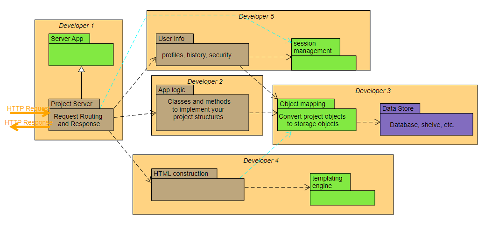

# Term Project - Team J
***
## Project Status 
Most of the functionality working.  ***FILL HERE***
## Project details
### Starting the app 

Running the main.py file should get the app started. ***FILL HERE***
### The Docs folder
##### Contains: 
- performance_reviews/ - Contains all the performance reviews done by everyone.
- user_stories/ - Contains all the user stories
- meetingNotes.md - Contains the meeting notes.
- applogic.md - Contains the applogic. Used only as a reference.
- architecture.png - The project architecture, which is same as assigned.
## The Architecture 
No major deviations from the architecture given in class were made.

- **Developer 1 - Gurleen**
- **Developer 2 - Rishi**
- **Developer 3 - Baasil**
- **Developer 4 - Cameron**
- **Developer 5 - Saurav**

## Progress tracking
- Meeting notes can be found [here.](https://github.com/CS2005F23/term-project-teamj/blob/master/docs/meetingNotes.md)
- Kanban board can be found [here.](https://github.com/orgs/CS2005F23/projects/19)

## Individual details
### File locations

There is a directory that contains performance reviews and user stories and features done by each person in the docs folder.
The project files done by each person are stored in individual folders. Details about the task, folders
and individual branches are given in the follwing table below.

### Task assignment Details

| Task                                           | Folder         | Owner   | Branch Name |
|------------------------------------------------|----------------|---------|-------|
| HTML and templating engine                     | HTML_Templates  | Cameron |    cameron     |
| Logic for the app                              | logic      | Rishi   |     rishi       |
| Server for the app                             | server     | Gurleen |  gurleen |
| Object mapping and persistent storage solution | storage    | Baasil  |  baasil |
| User info and Session management               | user_logic | Saurav  |     saurav      |

## Individual folder details

### HTML_Templates
##### Contains:
- Templates/ - Contains home_page.py, login_page.py and sign_in.py which   ***FILL HERE***

### logic
##### Contains:
- tweet1.py - Contains the logic for post interaction. ***FILL HERE***
### server
##### Contains:
- Server.py - Contains the implementation for the server ***FILL HERE***
- serverData
### storage
##### Contains:

- APP.db - Database file.
- dataHandler.py - Contains the dataBaseHandler class responsible for manipulating data.
- dbCreator.py - Created an initial handler and contains some sample users and messages.
- test_dataHandler.py - Test class for testing the functionality. Can be directly run (without "python -m unittest" command.)
- attributions.md - The attributions file.
### user_logic
##### Contains:
- authentication/ - Contains login.py, signin.py, testserver.py which   ***FILL HERE***
- login.py - 
- session_check.py - 
- signin.py - 

