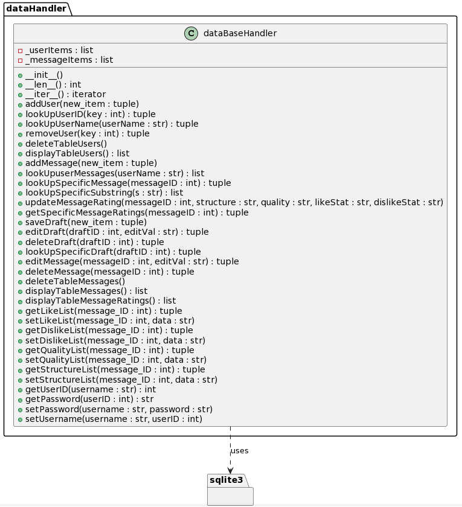

##### Contains:

- APP.db - Database file.
- dataHandler.py - Contains the dataBaseHandler class responsible for manipulating data.
- dbCreator.py - Created an initial handler and contains some sample users and messages.
- test_dataHandler.py - Test class for testing the functionality. Can be directly run (without "python -m unittest" command.)

#### Diagram:

